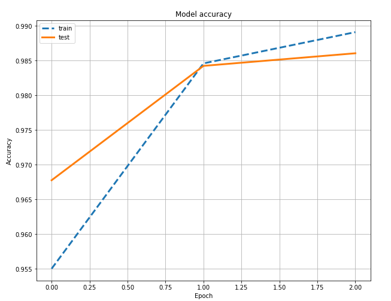
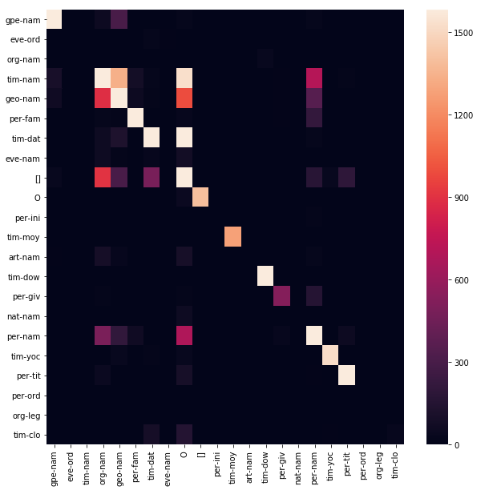

# Named-Entity-Recognition-For-GBM-Bank-Corpus

### Objective:
The purpose of this research was to build a Sequential Recurrent Neural Net classifier to predict the named entities of a big annotated corpus from Groningen Meaning Bank.

### Data:
The data is a large annotated corpus in the .tags files saved in “gmb-2.2.0.zip” on my local. All the tag files were merged and saved in a temporary file named “temp_tags” using the ZipFile and "Merge_Clean_Data", user_defined, functions. The merged data is saved as a pandas data frame with 5 columns with the given headers, “word”, ”pos”, ”token”, “tag”. The target variable is the tag column which has 41 different named entities. The tags with less than 15 occurrences were replaced with no label, "o", since they were labeled incorrectly. For example, "of" was labeled as time instead of O. After this cleaning step, the number of unique tags reduced to 22.

### Contents of Jupyter notebook:
    Step 0: Import Data  
    Step 1: Clean Data  
    Step 2: Explore Data  
    Step 3: Prepare Data for RNN  
    Step 4: Fitting a Bidirectional LSTM NN  
    Step 5: Evaluating The Model  
    Step 6: Train Other LSTM models, like forward or backward RNN's. 

### Classifier:
Here, I developed a deep bidirectional long short-term memory (LSTM) recurrent neural network.The reason I chose Bi_LSTM is that this RNN’s provides a very elegant way of dealing with sequential data while memorizing big correlations between sequence points. For many sequence labeling tasks, it is beneficial to have access to both past (left) and future (right) contexts, so I applied the Bidirectional Recurrent Neural Networks (RNNs). I also compared the result with just forwarding or backward RNN's to explore which one performs faster and better. 

### Metrics:
Since we are dealing with a multi-classification problem here, tag labels are highly imbalanced and the model didn't predict some tags, I preferred to evaluate the model base on Precision, Recall, and F1 score. F1-score which is a trade of between Precision and Recall is about 87.92%. 

### Results:
The accuracy plot shows how well the model was able to generalize to the new sequences by accuracy close to 98%. But, as I mentioned before accuracy is not the best metric for this kind of multi_classification tasks specially for NER modeling. The F1 score usually being used as a metric for this kind of task which was about 87.92%. But please see the training and validating accuracy plot as below:

Out of 22 different tags, the model was able to predict well on just 17 tags. It means the labels require more cleaning for further analysis. Please see the below confusion matrix:

### Potential improvements:
As I mentioned before, even though the model performs well, but it couldn't predict some tags. I believe it can be enhanced by taking more cleaning steps like grouping and correcting the labels in the original dataset. 

### Libraries:
tensorflow 2.0.0-rc1  
keras 2.3. 0

### References:
Got inspired by [this kaggle competition](https://www.kaggle.com/abhinavwalia95/entity-annotated-corpus) , [this paper](https://arxiv.org/abs/1606.06871) and [this one](https://arxiv.org/pdf/1603.01354.pdf) .
